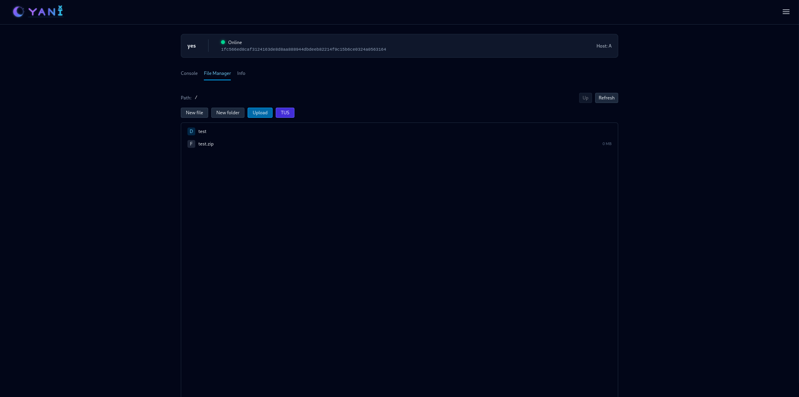
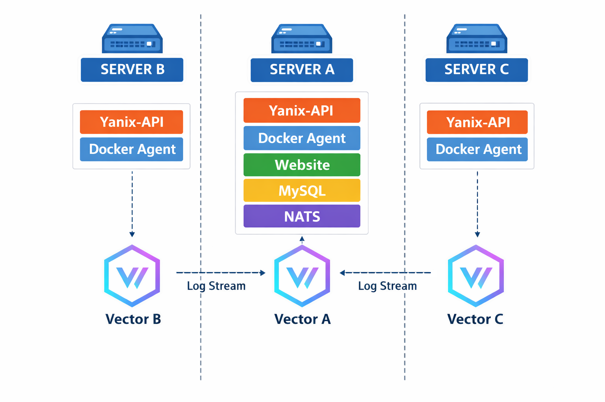
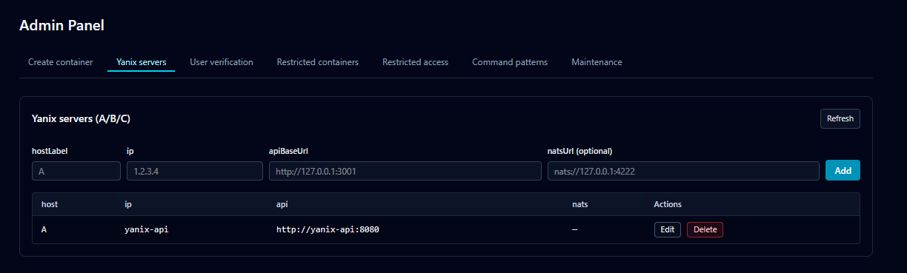
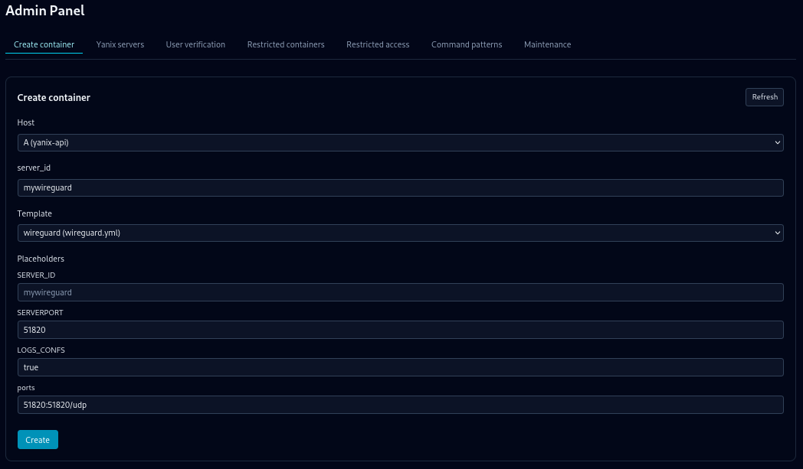

## What is this?

**Yanix Panel** is a lightweight web control panel for Docker containers, built on top of the **Docker API**. 

It lets you manage containers on the local host or on remote servers, and includes a web-based console, a file manager with archive extraction, and two APIs for automation and integration. Command execution follows the `docker exec` model, but interactive TTY sessions are not supported. Yanix Panel is especially well-suited for game servers, where management is typically done via one-off commands (for example RCON).


**Supported:**

* `docker exec <container> <command>`

**Not supported (-i or -it):**

* `docker exec -it <container>`

<details>
  <summary><strong>Screenshots</strong></summary>

  
  
  
  

</details>

<details>
  <summary><strong>Log Shipping Topology</strong></summary>

  <p>
    <a href="https://vector.dev/" target="_blank" rel="noopener noreferrer"><strong>Vector.dev</strong></a>
    is the primary component responsible for log transportation between servers and is deployed on each server as a Docker container.
  </p>

  

</details>


## Requirements

- **Docker Engine v27+** (cgroup v2 required)
- **OS:** Debian / Ubuntu
- **MySQL 8.0+**
- **acl** package (`apt-get install acl`)
- Basic Docker knowledge

## Installation

> **Please read this section from start to finish before running any commands.**

### Preparation stage

1. Install **MySQL 8.0+**
2. Create a **database**
3. Create a **MySQL user** with **full privileges** on that database  
   (save the database name, username, and password — you will need them)
4. Install `acl` if not installed

   ```bash
   sudo apt-get install -y acl
   ```

### Step 1 — Run the installer

1. Download `install.sh`
2. Make it executable and run it:

   ```bash
   chmod +x install.sh
   sudo ./install.sh
   ```

### Step 2 — Start the Docker Compose stack

1. Go to the Yanix core directory (startup files are stored here):

   ```bash
   cd /var/yanix/core
   ```
2. If needed, edit the startup/config files in this directory.
3. Start the stack:

   ```bash
   docker compose up -d
   ```
4. Wait until services are up.

### Step 3 — Register and enable your admin user

1. Open the panel in your browser and register:

   ```
   http://<server-ip>:3001
   ```

2. Connect to MySQL, find the `User` table, then **verify** your user and **grant admin**:

   ```sql
   UPDATE `User` SET isAdmin = 1 WHERE email = 'YourEmail@example.com';
   UPDATE `User` SET verified = 1 WHERE email = 'YourEmail@example.com';
   ```

3. Now you can sign in to the panel.

### Step 4 — Add the host in Admin Zone

1. Click the menu icon in the top-right corner and click **Admin**
2. Find the **Yanix Servers** section and add a server with these values:

* `hostLabel`: `A`
* `ip`: `yanix-api`
* URL: `http://yanix-api:8080`

3. Click **Add**


### Step 5 — Installation is complete.

Note: Now you can verify users using the admin panel

---

## How to add a container

### Option 1 — Add Yanix labels to your Docker Compose service

Add **two labels** to any container. Example:

```yaml
services:
  testcounter:
    image: alpine:3.20
    container_name: testcounter
    labels:
      com.yanix.role: "yanix-server"
      com.yanix.server_id: "testcounter"
    command: >
      sh -c 'i=0; while :; do i=$$((i+1)); printf "%d ..\n" "$$i"; sleep 1; done'
    restart: unless-stopped
```

**Notes**

* Do **not** edit `com.yanix.role: "yanix-server"` label
* Recommendation: Always set `com.yanix.server_id` to your container name (example: `"testcounter"`)


Start the container, and it should appear in the Yanix Panel.

---

### Option 2 — Create containers from templates

Templates are Docker Compose snippets stored on the host and rendered by Yanix when you use **Admin → Create container**. 

#### 0) Prepare a single-service Compose file

Create (or reuse) a `docker-compose.yml` that contains **exactly one** container under `services:`. Multi-service templates are not supported.

#### 1) Create a template file

Open the templates directory and create any `.yml` file, for example `test1.yml`:

```bash
cd /var/yanix/template/
sudo nano test1.yml
```

#### 2) Copy your Compose content into the template

#### 3) Edit the template using the rules below, then save

Make sure the template follows the **Template Rules** (array syntax, supported fields, placeholders).

#### 4) Create the container in the Admin panel

Open the admin panel, go to **Create container**, select your template, and fill the form (including any placeholders). `SERVER_ID` is the name of the container.

#### 5) Done

---

### Template Rules

#### Rule 1 — Use array syntax wherever Docker Compose allows it

Some Docker Compose fields support **two syntaxes**: *map* and *array*.
In Yanix templates, use the **array** syntax **whenever Docker Compose allows it**.
Only use map syntax where array syntax is not allowed by Compose.

Map syntax:

```yaml
environment:
  RACK_ENV: development
  SHOW: "true"
  USER_INPUT:
```

Array syntax (preferred):

```yaml
environment:
  - RACK_ENV=development
  - SHOW=true
  - USER_INPUT
```

#### Rule 2 — Supported vs not supported

**Not supported:**

* `build`
* `depends_on`
* networks:
* volumes:
* `privileged`
* `pid, ipc, uts, cgroup`
* `dns, dns_search`
* `runtime`
* `stop_grace_period, stop_signal`
* `x-... extensions`
* `extends`
* `links`
* `profiles`
* `deploy`

**Supported (examples):**

<details>
  <summary><strong>A lot</strong></summary>

  <ul>
    <li><code>image</code></li>
    <li><code>container_name (will be ignored)</code></li>
    <li><code>tty</code></li>
    <li><code>stdin_open</code></li>
    <li><code>ports</code></li>
    <li><code>environment</code></li>
    <li><code>env_file</code> (not sure)</li>
    <li><code>volumes</code></li>
    <li><code>volumes_from</code></li>
    <li><code>command</code></li>
    <li><code>entrypoint</code></li>
    <li><code>restart</code></li>
    <li><code>user</code></li>
    <li><code>working_dir</code></li>
    <li><code>extra_hosts</code></li>
    <li><code>logging</code></li>
    <li><code>healthcheck</code></li>
    <li><code>labels</code></li>
    <li><code>read_only</code></li>
    <li><code>devices</code></li>
    <li><code>cap_add, cap_drop</code></li>
    <li><code>security_opt</code></li>
    <li><code>ulimits</code></li>
    <li><code>sysctls</code></li>
    <li><code>network_mode</code></li>
    <li><code>networks</code></li>
    <li><code>network_mode</code></li>
    <li><code>cpus, cpu_shares, mem_limit, mem_reservation</code></li>
  </ul>

</details>


#### Rule 3 — Placeholders

You make templates reusable by putting placeholders in them (for example `{{PORT1}}`, `{{RAMlimit}}`, etc.). When you create a container in **Create container**, Yanix Panel will ask you to enter values for these placeholders and will automatically replace them in the template before starting the container.


**Unique placeholder:**

* `{{SERVER_ID}}` — always substituted automatically with the container name you choose in the UI.


<details>
  <summary><strong>Example</strong></summary>

WireGuard already uses array syntax for `environment`, so it mostly needs placeholders.

**Before:**

```yaml
services:
  wireguard:
    image: lscr.io/linuxserver/wireguard:latest
    container_name: wireguard
    cap_add:
      - NET_ADMIN
      - SYS_MODULE #optional
    environment:
      - PUID=1000
      - PGID=1000
      - TZ=Etc/UTC
      - SERVERURL=wireguard.domain.com #optional
      - SERVERPORT=51820 #optional
      - PEERS=1 #optional
      - PEERDNS=auto #optional
      - INTERNAL_SUBNET=10.13.13.0 #optional
      - ALLOWEDIPS=0.0.0.0/0 #optional
      - PERSISTENTKEEPALIVE_PEERS= #optional
      - LOG_CONFS=true #optional
    volumes:
      - /path/to/wireguard/config:/config
      - /lib/modules:/lib/modules #optional
    ports:
      - 51820:51820/udp
    sysctls:
      - net.ipv4.conf.all.src_valid_mark=1
    restart: unless-stopped
```

**After (template):**

```yaml
services:
  wireguard:
    image: lscr.io/linuxserver/wireguard:latest
    container_name: wireguard
    cap_add:
      - NET_ADMIN
      - SYS_MODULE
    environment:
      - PUID=1000
      - PGID=1000
      - TZ=Etc/UTC
      - SERVERURL=wireguard.domain.com
      - SERVERPORT={{SERVERPORT}}
      - PEERS=1
      - PEERDNS=auto
      - INTERNAL_SUBNET=10.13.13.0
      - ALLOWEDIPS=0.0.0.0/0
      - PERSISTENTKEEPALIVE_PEERS=
      - LOG_CONFS={{LOG_CONFS}}
    volumes:
      - /var/yanix/container/{{SERVER_ID}}/wireguard-config:/config
      - /lib/modules:/lib/modules
    ports:
      - {{ports}}
    sysctls:
      - net.ipv4.conf.all.src_valid_mark=1
    restart: unless-stopped
```
**Screenshot**


</details>

---

## Sending commands

### How it works

When you run a command in the panel, Yanix sends it to the **Docker API**, and Docker forwards it into the container (similar to `docker exec`).

Important detail: Docker does **not** receive your command as one full string. It receives an **array of arguments** (`["cmd", "arg1", "arg2", ...]`).
So your command must be **split into correct tokens** (arguments). If you split it incorrectly, Docker will execute something different from what you intended.

### Preparation

Take any `docker exec` command **without** `-i`.

### General steps

1. Remove `docker exec <container>` — the panel adds this part automatically.
2. Split the remaining command into:

   * **Stable part** (always the same)
   * **User input part** (changes depending on what you type)
3. Replace the user input part with `{{INPUT}}` (or `{{INPUT_ARGS}}`, see note below).
4. Convert the stable part into an argument array.


<details>
  <summary><strong>Example 1 — rcon-cli</strong></summary>

**Original command:**

```bash
docker exec container1 rcon-cli -a 127.0.0.1:7777 -p password 'servermsg "8 min"'
```

**Step 1 — Remove `docker exec container1`:**
Panel will add it automatically.

Remaining:

```bash
rcon-cli -a 127.0.0.1:7777 -p password 'servermsg "8 min"'
```

**Step 2 — Stable part (does not change):**

```bash
rcon-cli -a 127.0.0.1:7777 -p password
```

**Step 3 — User input part (changes):**

```bash
'servermsg "8 min"'
```

**Step 4 — Replace user input with `{{INPUT}}` and split stable part into tokens**

**Result:**

```json
["rcon-cli", "-a", "127.0.0.1:7777", "-p", "CHANGEME", "{{INPUT}}"]
```

</details>


<details>
  <summary><strong>Example 2 — sh -lc</strong></summary>

**Original command:**

```bash
docker exec container2 sh -lc 'echo "hello from sh" >> /proc/1/fd/1 2>&1'
```

**Step 1 — Remove `docker exec container2`:**

Remaining:

```bash
sh -lc 'echo "hello from sh" >> /proc/1/fd/1 2>&1'
```

**Step 2 — Stable part:**

```bash
sh -lc
```

**Step 3 — User input part:**

```bash
'echo "hello from sh" >> /proc/1/fd/1 2>&1'
```

**Step 4 — Replace user input with `{{INPUT}}` and split stable part**

**Result:**

```json
["sh", "-lc", "{{INPUT}}"]
```

</details>


5. Open **Admin → Command Patterns**:
   * Create a new pattern and paste your JSON array (like in examples above).
   * On the same page (below), add the container’s **dockerId** and select the created pattern.
   *  Done.


### Note: `{{INPUT}}` vs `{{INPUT_ARGS}}`

If a pattern does not work as expected, try replacing `{{INPUT}}` with `{{INPUT_ARGS}}`.

* `{{INPUT}}` inserts your input as a single argument (best when the tool expects one “payload string”).
* `{{INPUT_ARGS}}` applies shell-like argument splitting, which can help when your input contains multiple flags/args.

---

## Enable HTTPS

1. Open:

```bash
sudo nano /var/yanix/core/docker-compose.yml
```

2. In `yanix-website`, set:

```yaml
environment:
  COOKIE_SECURE: "true"        # HTTPS
  TRUST_PROXY_IP: "172.xx.yy.1" # proxy
```

3. See the example reverse proxy config in:

* `/example/nginx` (github)

## Multi-server support

Multi-server support is already implemented. A step-by-step setup guide is in progress and will be added to the README soon!!!


4. The remaining steps depend on your proxy/cert setup.
